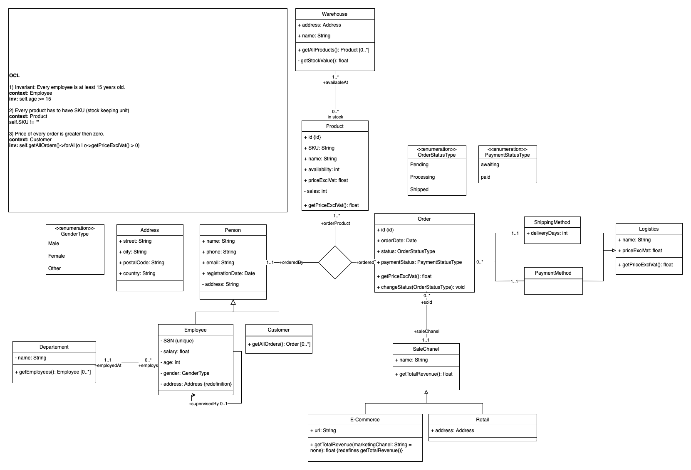
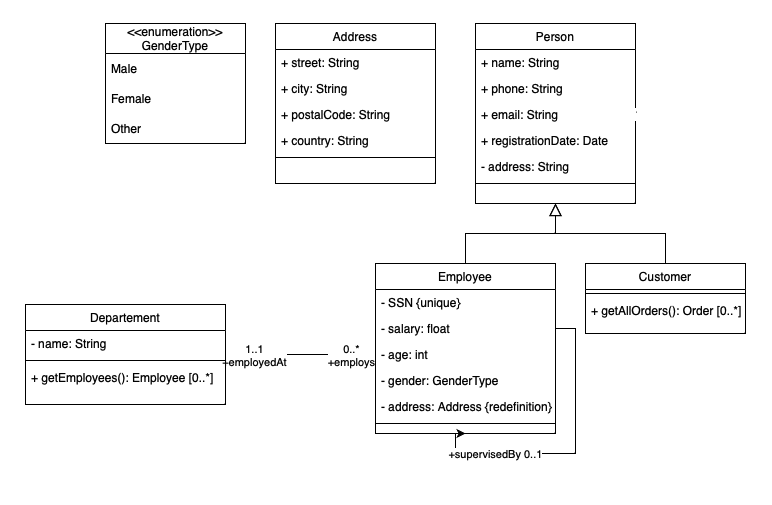
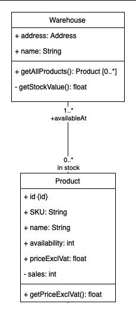
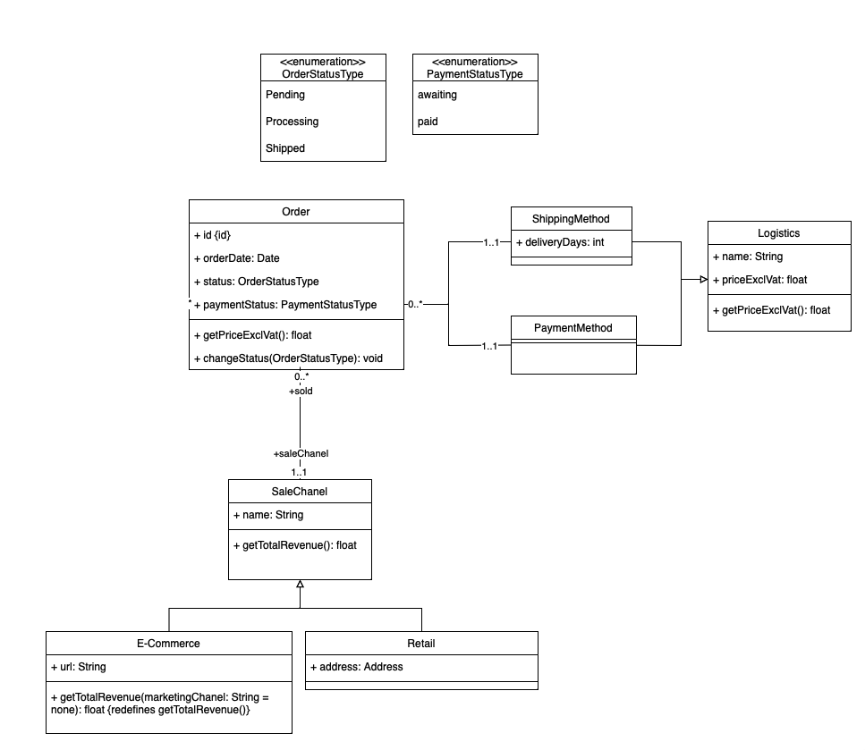

# UML & OCL

## Úvod

UML model [diagram.png](diagram.png) reprezentuje jednoduchou firmu obchodující jak online, tak i jako kamenný obchod. Model 
obsahuje entity pro zákazníky, zaměstnance, zboží, skladovací prostory, prodeje a prodejní místa.


## Dokumentace
Tato část popisuje jednotlivé části celého modelu

### Člověk

Abychom mohli reprezentovat zákazníky a zaměstnance, je potřeba vytvořit abstraktní třídu člověk, ze které budou zmíněné třídy vycházet.
Díky OCL můžeme vytvořit invariant na věk zaměstnanců.
```
context: Employee
inv: self.age >= 15
```

### Produkt

Produkt je třída reprezentující zboží, které je možné zakoupit. Každý produkt má svůj název, cenu a může být skladováno v několika skladovacích prostorech.
Pomocí OCL můžeme vytvořit invariant, který zajistí, že produkt má vždy SKU (kód produktu).
```
context: Product
inv: self.name != ""
```

### Objednávka a prodejní místo

Objednávka je třída reprezentující > 0 produktů, které zákazník zakoupil. Každá objednávka dodací a platební metodu, přiřazený stav objednávky a stav platby.
Zároveň u objednávky evidujeme její původ prostřednictvím třídy `SaleChanel` (online, kamenný obchod).
Pro objedavky definujeme OCL invariant, který zajistí, že cena objednávky je vždy větší než 0 (aby nevznikaly "prázdné" objednávky).
```
context: Customer
inv: self.getAllOrders()->forAll(o | o->getPriceExclVat() > 0)
```